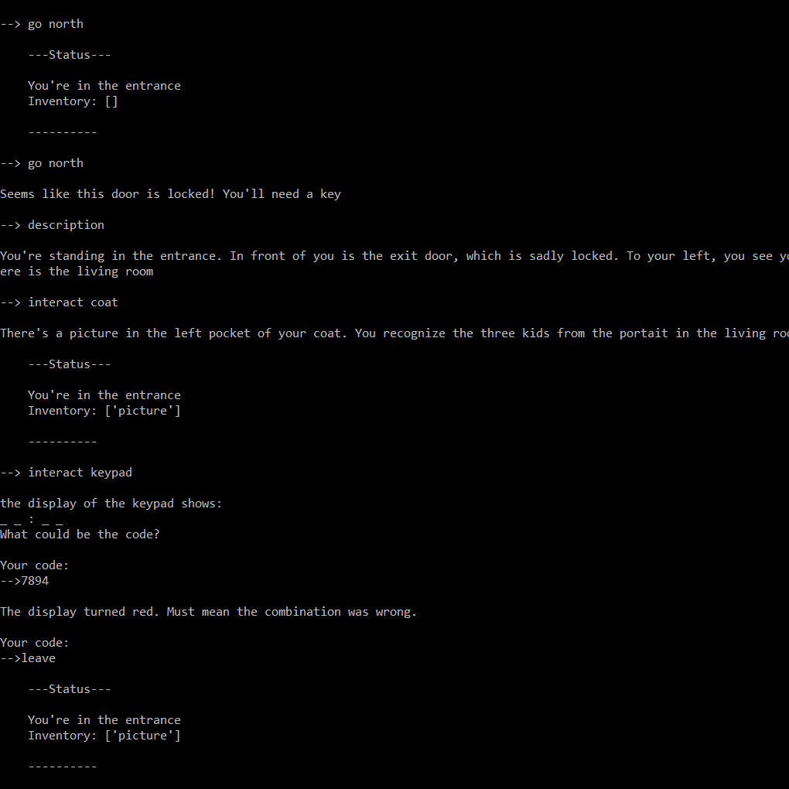
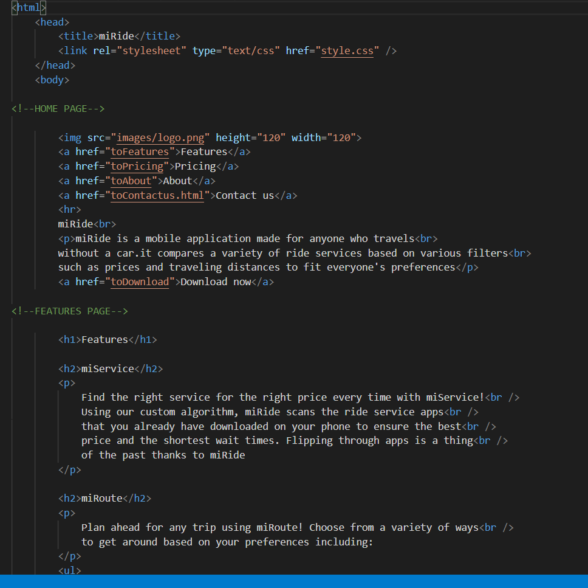

<!DOCTYPE html>

<html>

     <html lang="en-US">
<head>
                
    <title>Marianne</title>
    <meta charset="UTF-8">
    <meta name="description" content="Marianne's info, CV and projects are all listed in this site.">
    <meta name="author" content="Marianne D">
    <meta name="viewport" content="width=device-width, initial-scale=1.0">
    <link rel="stylesheet" href="stylesheet3.0.css" >
                
</head>

<body>

<!--Background-->

    <!--Header-->

    <header class="white">
        
<h1>Marianne Dery</h1>
        
-Software Engineering Student-

        
<a href="Documents/CV professionel.docx" target="_blank" class="CV">Download CV</a>

    </header>
        

    <!--About-->

    

        <h1 class="about">About</h1>

        
I am a software engineering student at the University of Ottawa. I'm currently on my first year. I chose to 
           go into software engineering during 2015's summer. Bored, I stumbled unto a website teaching different languages.
           I started with HTML and CSS, and simply went on from them. In 2019, I made a report about different leraning                 algorithms used by AIs for a class. I was so interested, I knew programming was made for me. Since then, I've
           learned and keep on learning many langages, such as Python, Java and JavaScript.
        

    

    <!--Projects-->

    

        <h1 class="white">Projects</h1>

.

        
          <!--Contains the projects' images-->
            
          <!--Each projects-->
                
                <a href="projects.html#p1" class="projects" target="_blank">        <!--Fade in link to the project's page-->
                    

Artificial intelligence <small>-Report-</small>

                </a>
            

            

                
                <a href="projects.html#p2" class="projects"  target="_blank">
                    

Puzzle game <small>-Python-</small>

                </a>
            

            

                
                <a href="projects.html#p3" class="projects" target="_blank">
                    

Personal webpage <small>-Web Dev-</small>

                </a>
            

            

                
                <a href="main_page.html" class="projects"  target="_blank">
                    

miRide <small>-Web Dev-</small>

                </a>
            

        

    

    <!--Education-->

    

        

            <h1 class="notop education">Education</h1>

            

                <h2 class="diploma">BASc in Software Engineering (CO-OP)</h2>        <!--Diploma-->
                
September 2019 - Present
     <!--Year where I was following the course-->
                
University of Ottawa
     <!--School's name-->
                <h2 class="diploma">Diploma of Collegial Studies in Natural Science</h2>
                
September 2017 - August 2019

                
Cegep of Outaouais (Gatineau, Quebec)

            

        

        

            <h1 class="notop education">Awards</h1>

            <ul class="awards notop nobottom">
                <li class="awards"> Honorary mentions08/2019</li>
                
Awarded to only one girl per engineering
                        programs, per year, for her academic and extracurricular achievement as well as
                        her motivation to study in engineering

                <li class="awards notop">Director General's award of excellence06/2013</li>        <!--Award title + date-->
                
For her superior academic average, her
                        good behavior and her constant and applied work
      <!--Award's short description-->
                <li class="awards">Award of distinction05/2013</li>
                
Waterloo's faculty of mathematics emphasize the success of
                        students who scored within the top 20 percent during Gauss' mathematics
                        contest

                <li class="awards"> Honorary mentions08/2012 - 06-2017</li>
                
Awards received for being within the first percentile rank in
                        Chemistry, Mathematics, Ethics, French, English and Arts

            </ul>
        

    

    <!--Skills-->

    
 
        <h1 class="notop">Skills</h1>

        

            
<i class ="arrow up disabled"></i>

            
     <!--Each skills-->
                <!--A skill can be expert, specialist, skilled, average or beginner-->
                

Html

      <!--Skill's name-->
                

     <!--Skill bar, indicates the skill's level in a visual way-->
                
Skilled
        <!--Skill's level, written-->
            

            

                

CSS

                

                
Skilled

            

            

                

Java Script

                

                
Average

            

            

                

Java

                

                
Beginner

            

            

                

Python

                

                
Skilled

            

            
<i class ="arrow down" onclick="button1()"></i>

        

        

            
<i class ="arrow up"  onclick="button2()"></i>

            

                

Git

                

                
Average

            

            

                

Languages:

                

                
.

            

            

                

French

                

                
Fluent

            

            

                

English

                

                
Fluent

            

            

                

.

                

                
.

            

            
<i class ="arrow down disabled"></i>

        

    

    <!--Experience-->

    

        <h1 class="notop exp">Experiences</h1>

        

        

            <h2 class="job">Checkout supervisor</h2> <!--Job's title-->
            
05/2018 - 09/2019
     <!--Dates for start and end of work-->
            <ul class="job">        <!--Small description of the job-->
                <li class="notop">Took on additional responsibilities which came with the supervisor post within 3
                    months</li>
                <li class="notop">Gained communication and problem-solving skills through diverse interactions
                    with the clients</li>
                <li>Proved great leadership by dividing the tasks within the work team</li>
                <li class="nobottom">Managed efficiently my time in order to accomplish many tasks simultaneously
                    such as gestion work, supervising the employees and giving a good service to
                    the clients</li>
            </ul>
        

        

            <h2 class="job">Coordination and logistic of promotional material</h2>
            
02/2017 - 05/2018 

            <ul class="job">
                <li>Developed great efficacity by assembling promotional briefcases</li>
                <li>Learned organization techniques by working with efficacity</li>
            </ul>
        

        

            <h2 class="job">Babysitter</h2>
            
01/2012 - Present

            <ul class="job">
                <li>Supervised the kids to keep them in a safe and reassuring environment</li>
                <li>Demonstrated creativity by creating games to entertain the kids</li>
                <li>Respected the parent’s instructions</li>
            </ul>
        

        

    

    <!--Contact-->

    

        <h1 class="white notop">Contact</h1>

.

        

            <address>Marianne Dery mdery022@uottawa.ca 873-376-5422</address>     <!--Contact info-->
        

        

            <address>       <!--Social media-->
                <a href="https://github.com/K3yl3th" target="_blank" class="contact">
                    GitHub 
                </a>
                <a href="https://twitter.com/arya_s_" target="_blank" class="contact">
                    Twitter 
                </a>
                <a href="https://www.linkedin.com/in/marianne-dery-043b06195/" target="_blank" class="contact">
                    Linkedin
                </a>
            </address>
        

    

    

</body>

</html>
